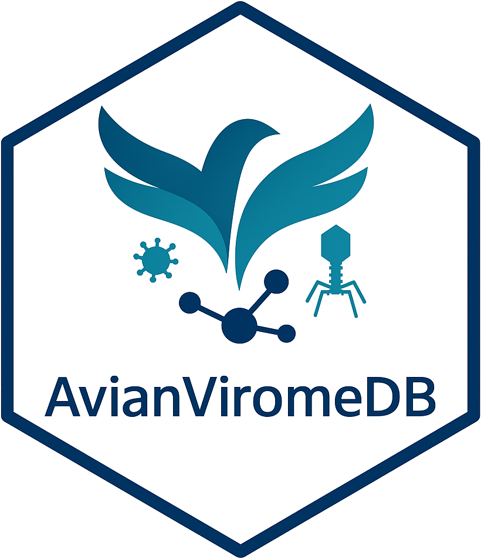

<!-- README.md is generated from README.Rmd. Please edit that file -->

```{r, include = FALSE}
knitr::opts_chunk$set(
  collapse = TRUE,
  comment = "#>",
  fig.path = "man/figures/README-",
  out.width = "100%"
)
```

# AvianViromeDB 

<!-- badges: start -->

[](https://www.gnu.org/licenses/gpl-3.0.en.html)
[](https://doi.org/10.5281/zenodo.15660656)

<!-- badges: end -->

## Overview

AvianViromeDB is a comprehensive database for exploring and analyzing avian bacteriophage (virome) sequences. The database contains bacteriophage sequences identified from public NGS sequencing data of avian samples. The sequences have been assembled into contigs, annotated, and classified taxonomically.

The database can be accessed at [AvianViromeDB](https://phagebyte.github.io/avianviromedb).
